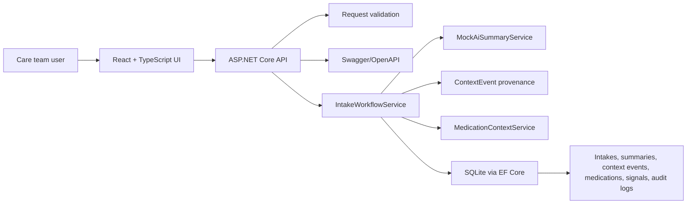

# Clinical Intake AI Workflow

[](https://github.com/Pharmacist65/clinical-intake-ai-workflow/actions/workflows/ci.yml)

A small full-stack healthtech application that models a safe clinical intake workflow: capturing fictional intake notes, generating deterministic AI-style workflow summaries, flagging possible priority terms, routing cases for human review, and preserving an audit trail.

The project is intentionally scoped as a small MVP for exploring safe clinical workflow automation. It does not diagnose, prescribe, triage autonomously, or replace clinicians. It uses mock AI logic so the workflow can run locally without API keys, real patient data, or hidden model behaviour.

## Project Scope

Clinical teams often receive intake information as free text from calls, forms, family messages, or referrals. A useful first software step is not to automate clinical judgment. It is to preserve the original note, make workflow state visible, surface possible safety or priority terms, and route uncertain cases to qualified human review.

This application focuses on that workflow:

- intake capture
- deterministic AI-style summarisation
- context source capture
- medication-history context capture
- risk flag visibility
- confidence scoring
- human review queue
- review status updates
- audit logs

## What This Project Demonstrates

- Clinical workflow understanding: intake capture, review queues, status transitions, risk visibility, and audit history
- Healthtech product thinking: human review is central, original notes remain visible, and limitations are explicit
- C# ASP.NET Core backend fundamentals: minimal API endpoints, validation, service-layer workflow logic, Swagger/OpenAPI documentation, and consistent error responses
- React + TypeScript frontend: dashboard, intake creation, detail view, summary generation, and review queue UI
- Database-backed workflow: SQLite with Entity Framework Core models for intakes, summaries, risk flags, and audit logs
- Pharmacy context layer: medication-history capture, documentation quality checks, pharmacist-review signals, and medication timeline
- Context source provenance: fictional text-derived context sources can be stored with source type, label, author, timing, confidence, and audit history
- Evidence-linked review signals: risk flags and medication signals include short source snippets when deterministic rules are triggered
- Safe applied AI design: deterministic mock AI, no API keys required, confidence scoring, disclaimers, and constrained output
- Human-in-the-loop review: high-risk or low-confidence cases are routed to `NeedsReview`
- Auditability: intake creation, summary generation, medication context analysis, review notes, and review status updates are recorded
- Evaluation discipline: fictional dataset-driven tests check expected routing, risk flags, medication signals, and documentation-quality status
- Future-safe architecture thinking: implemented text-source provenance plus documented interoperability and multimodal concepts without claiming live EHR, audio, OCR, image or LLM capability

## Product Summary

The app lets a care team user:

1. Create a fictional intake note.
2. Generate a deterministic AI-style structured summary.
3. See possible risk flags and confidence score.
4. Add fictional text context sources such as transcript text, document text, medication-history notes, or manual team notes.
5. Record medication-history context for pharmacist/clinician review.
6. View medication documentation quality gaps.
7. Generate medication review signals and reviewer questions.
8. Route high-risk or low-confidence cases to review.
9. Mark cases as reviewed with an optional workflow review note.
10. Inspect the audit log for key workflow actions.

## Screenshots

The screenshots below use fictional demo data only.

### Dashboard


### Intake Detail


### Review Queue


## Tech Stack

- Backend: ASP.NET Core Web API, C#
- Runtime target: .NET 8 LTS
- Database: SQLite with Entity Framework Core
- Tests: xUnit unit tests, API integration tests, and fictional dataset-driven workflow checks
- Frontend: React, TypeScript, Vite
- AI mode: deterministic mock service, no real API key required
- API docs: Swagger/OpenAPI at `/swagger`
- CI: GitHub Actions runs backend tests and frontend build on push and pull request

## Architecture Overview



The backend keeps HTTP handling thin. Request validation lives in small validators, workflow transitions live in `IntakeWorkflowService`, response mapping lives in `IntakeMapper`, deterministic summary generation lives behind `IAiSummaryService`, demo data is created by `DemoDataSeeder`, text context provenance is captured through `ContextEvent`, and medication review signals are generated by `MedicationContextService`.

## Interoperability Concept

The project includes a FHIR/HL7 concept document to show how the internal workflow could later relate to healthcare interoperability standards without implementing a live EHR integration.

See [docs/fhir-hl7-integration-concept.md](docs/fhir-hl7-integration-concept.md) for the conceptual mapping between internal models such as `Intake`, `MedicationEntry`, `MedicationSignal`, `ReviewStatus`, and possible FHIR concepts such as `QuestionnaireResponse`, `MedicationStatement`, `Task`, `Provenance`, and `AuditEvent`.

This is documentation only. The current application does not connect to NHS systems, EHRs, pharmacy systems, FHIR servers, or HL7 message feeds.

## Multimodal Clinical Context Concept

The project implements a small first step toward the multimodal clinical context concept: fictional text-derived context sources can be recorded as `ContextEvent` records with source type, source label, content, captured time, author, optional confidence score, and optional metadata.

This is still text-only workflow support. The current application does not process audio, clinical images, scanned documents, real patient records, or live healthcare feeds. Future transcript/OCR/LLM adapters remain planned only. The concept focuses on preserving source provenance, linking review signals to short evidence snippets, and routing prompts to qualified human review.

See [docs/multimodal-clinical-context-layer.md](docs/multimodal-clinical-context-layer.md) for the implemented `ContextEvent` model, evidence-linked review signal concept, safety boundaries, and future implementation sequence.

## Pharmacy Context Layer

The Pharmacy Context Layer adds medication-history capture and pharmacist-review context to the intake workflow. It is intended to surface information that can be missed during intake, especially OTC medicines, incomplete dose/frequency details, unclear source/timing, household medication context, and possible adverse reaction history.

NSAID handling is included as one concrete OTC medication-context example, not as the centre of the system. The pharmacy layer is broader than NSAID detection: it is designed around medication-history completeness, documentation quality, adverse-reaction prompts, household medication context, polypharmacy context, and routing relevant questions to pharmacist/clinician review.

The documentation quality score reflects completeness of captured medication-history fields only. It is not a clinical risk score and does not decide whether a medicine is safe, appropriate, or causally related to symptoms.

Medication outputs are framed only as workflow support signals and reviewer questions. The system does not diagnose, prescribe, recommend treatment, infer causality, or perform real drug-interaction checking.

This feature does not perform medication reconciliation, drug interaction checking, clinical decision support, prescribing advice, or diagnosis. It only captures medication context and creates review prompts for qualified human review.

Medication context can contribute to `NeedsReview` routing when a high-severity medication signal is generated. This is a workflow routing signal for human review, not autonomous triage.

See [docs/pharmacy-context-layer.md](docs/pharmacy-context-layer.md) for the full safety explanation.

## Evaluation Dataset

The repository includes a small fictional evaluation dataset for deterministic workflow checks. The dataset runs representative intake and medication-context scenarios through the real backend workflow service and verifies expected review status, confidence thresholds, risk labels, medication signal labels, and medication documentation quality status.

This is not clinical validation. It does not measure diagnostic accuracy, prescribing safety, medication appropriateness, triage quality, or real-world model performance. It exists to make the MVP easier to inspect and to prevent regressions in the deterministic workflow rules.

See [docs/evaluation-dataset.md](docs/evaluation-dataset.md) for the dataset scope, current fictional cases, and safety boundaries.

## API Documentation

Base URL for local development:

```text
http://localhost:5108
```

Interactive API documentation is available at:

```text
http://localhost:5108/swagger
```

All responses are JSON.

### Error Response Shape

Validation errors return `400 Bad Request`:

```json
{
  "code": "validation_error",
  "message": "Request validation failed.",
  "errors": [
    {
      "field": "PatientAlias",
      "message": "PatientAlias is required."
    }
  ]
}
```

Missing intakes return `404 Not Found`:

```json
{
  "code": "not_found",
  "message": "Intake not found.",
  "errors": []
}
```

Unexpected failures return `500 Internal Server Error` with the same simple error contract:

```json
{
  "code": "server_error",
  "message": "An unexpected error occurred.",
  "errors": []
}
```

### Endpoints

| Method | Endpoint | Success | Purpose |
| --- | --- | --- | --- |
| `GET` | `/api/health` | `200 OK` | Basic API health check |
| `POST` | `/api/intakes` | `201 Created` | Create a new fictional intake |
| `GET` | `/api/intakes` | `200 OK` | List intakes with status and highest risk |
| `GET` | `/api/intakes/{id}` | `200 OK` | Get one intake with summary, flags, medication context, signals, and audit logs |
| `POST` | `/api/intakes/{id}/generate-summary` | `200 OK` | Generate or regenerate deterministic AI-style summary |
| `GET` | `/api/review-queue` | `200 OK` | List intakes currently marked `NeedsReview` |
| `PATCH` | `/api/intakes/{id}/review-status` | `200 OK` | Update review status and create audit log entry |
| `GET` | `/api/intakes/{id}/audit-log` | `200 OK` | Read audit log entries for one intake |
| `POST` | `/api/intakes/{id}/context-events` | `201 Created` | Add a fictional text context source |
| `GET` | `/api/intakes/{id}/context-events` | `200 OK` | List text context sources for one intake |
| `POST` | `/api/intakes/{id}/medications` | `201 Created` | Add medication-history context |
| `GET` | `/api/intakes/{id}/medications` | `200 OK` | List medication entries for one intake |
| `POST` | `/api/intakes/{id}/analyse-medication-context` | `200 OK` | Generate medication review signals |
| `GET` | `/api/intakes/{id}/medication-signals` | `200 OK` | List medication review signals |
| `GET` | `/api/intakes/{id}/medication-documentation-quality` | `200 OK` | Assess medication-history documentation completeness |

### Create Intake

`POST /api/intakes`

Request:

```json
{
  "patientAlias": "Patient A",
  "age": 12,
  "intakeText": "Family reports school concerns, poor sleep and attention changes.",
  "source": "family phone note",
  "createdBy": "demo-user"
}
```

Validation:

- `patientAlias` is required, max 120 characters.
- `age` must be between 0 and 120.
- `intakeText` is required, max 8000 characters.
- `source` is required, max 80 characters.
- `createdBy` is required, max 120 characters.

### Generate Summary

`POST /api/intakes/{id}/generate-summary`

The summary is generated by `MockAiSummaryService`. If a summary already exists, it is updated and previous risk flags are replaced. This keeps regeneration deterministic and avoids stale flags.

Routing rule:

- If confidence is below `0.75`, set `reviewStatus` to `NeedsReview`.
- If any risk flag is `High`, set `reviewStatus` to `NeedsReview`.
- Otherwise keep the case in `New` until a human reviewer marks it reviewed.

### Update Review Status

`PATCH /api/intakes/{id}/review-status`

Request:

```json
{
  "reviewStatus": "Reviewed",
  "actor": "clinical-reviewer",
  "reviewNote": "Reviewed by qualified human reviewer in demo workflow."
}
```

Validation:

- `reviewStatus` must be `New`, `NeedsReview`, or `Reviewed`.
- `actor` is required, max 120 characters.
- `reviewNote` is optional, max 1000 characters.

Every status change creates an audit log entry. If `reviewNote` is provided, it is stored in the audit log as workflow context, not as clinical advice.

### Add Context Event

`POST /api/intakes/{id}/context-events`

Request:

```json
{
  "sourceType": "TranscriptText",
  "sourceLabel": "Fictional family call transcript",
  "content": "Family described sleep disruption and school support needs.",
  "capturedAt": null,
  "createdBy": "demo-user",
  "confidenceScore": 0.88,
  "metadataJson": null
}
```

Supported source types:

- `IntakeText`
- `TranscriptText`
- `DocumentText`
- `MedicationHistory`
- `ManualNote`

Context events preserve source provenance for workflow review. They do not diagnose, triage, prescribe, interpret audio or images, or generate clinical advice.

Validation keeps source type constrained, confidence score between `0` and `1` when provided, and `metadataJson` valid JSON when present.

### Add Medication Context

`POST /api/intakes/{id}/medications`

Request:

```json
{
  "medicationName": "Ibuprofen",
  "category": "OTC",
  "dose": "200 mg",
  "route": "oral",
  "frequency": "up to three times daily",
  "startedAt": null,
  "stoppedAt": null,
  "reasonForUse": "Pain relief",
  "source": "FamilyReported",
  "prescribedBy": null,
  "notes": "Family unsure about duration"
}
```

Medication categories:

- `Current`
- `Recent`
- `Past`
- `OTC`
- `FamilyHousehold`

Medication sources:

- `PatientReported`
- `FamilyReported`
- `ClinicianReported`
- `Unknown`

### Analyse Medication Context

`POST /api/intakes/{id}/analyse-medication-context`

This endpoint runs deterministic medication-history rules and creates review signals. NSAID context can come from the medication name, intake text, or medication notes, but NSAID handling is only one example rule within a wider medication-context workflow. It does not perform clinical decision support or real drug-interaction checking.

Examples of generated signals:

- OTC NSAID context
- Medication safety review signal
- Incomplete medication history
- Polypharmacy context
- Household medication context
- Possible adverse reaction history

### Medication Documentation Quality

`GET /api/intakes/{id}/medication-documentation-quality`

This endpoint calculates a non-clinical documentation completeness score from the medication entries already captured for an intake. It looks for missing fields such as dose, frequency, route, timing, reason for use, and unknown source.

The score is for workflow documentation quality only. It is not a clinical risk score, medication reconciliation, diagnosis, prescribing advice, drug-interaction checking, or clinical decision support.

Example response:

```json
{
  "score": 55,
  "status": "Incomplete",
  "summary": "Medication context has important documentation gaps that should be clarified by a human reviewer.",
  "issues": [
    {
      "medicationEntryId": 4,
      "medicationName": "Cetirizine",
      "field": "dose",
      "reason": "Dose is missing for a current or recent medication."
    }
  ],
  "disclaimer": "Medication documentation quality reflects completeness of captured medication-history fields only. It is not a clinical risk score, diagnosis, prescribing recommendation, medication reconciliation, drug-interaction check, or clinical decision support."
}
```

## Database Models

### Intake

- `id`
- `patientAlias`
- `age`
- `intakeText`
- `source`
- `reviewStatus`: `New`, `NeedsReview`, `Reviewed`
- `createdAt`
- `createdBy`

### AiSummary

- `id`
- `intakeId`
- `presentingConcerns`
- `relevantHistory`
- `possibleRisks`
- `recommendedNextStep`
- `confidenceScore`
- `generatedAt`
- `disclaimer`

### RiskFlag

- `id`
- `intakeId`
- `label`
- `severity`: `Low`, `Medium`, `High`
- `reason`
- `evidenceSourceType`
- `evidenceSourceLabel`
- `evidenceSnippet`

### ContextEvent

- `id`
- `intakeId`
- `sourceType`: `IntakeText`, `TranscriptText`, `DocumentText`, `MedicationHistory`, `ManualNote`
- `sourceLabel`
- `content`
- `capturedAt`
- `createdBy`
- `confidenceScore`
- `metadataJson`
- `createdAt`

### AuditLog

- `id`
- `intakeId`
- `action`
- `actor`
- `timestamp`
- `details`

### MedicationEntry

- `id`
- `intakeId`
- `medicationName`
- `normalizedName`
- `category`: `Current`, `Recent`, `Past`, `OTC`, `FamilyHousehold`
- `dose`
- `route`
- `frequency`
- `startedAt`
- `stoppedAt`
- `reasonForUse`
- `source`: `PatientReported`, `FamilyReported`, `ClinicianReported`, `Unknown`
- `prescribedBy`
- `notes`
- `createdAt`

### MedicationSignal

- `id`
- `intakeId`
- `medicationEntryId`
- `label`
- `severity`: `Low`, `Medium`, `High`
- `rationale`
- `reviewerQuestion`
- `evidenceSourceType`
- `evidenceSourceLabel`
- `evidenceSnippet`
- `createdAt`

### MedicationDocumentationQuality

This is computed from captured medication entries rather than stored as a separate table.

- `score`: nullable percentage from 0 to 100
- `status`: `NotAssessed`, `WellDocumented`, `NeedsClarification`, `Incomplete`
- `summary`
- `issues`
- `disclaimer`

## Healthcare AI Safety Design

The app is intentionally constrained:

- It does not diagnose.
- It does not prescribe.
- It does not recommend treatment.
- It does not autonomously triage.
- It does not use real patient data.
- It stores the original intake beside the generated summary.
- It stores additional context sources with provenance instead of hiding them behind AI output.
- It uses deterministic mock AI rules in this version.
- It includes a confidence score and safety disclaimer.
- It shows evidence snippets for generated review signals where a deterministic rule matched source text.
- High-risk keywords route the case to human review.
- Low-confidence summaries route the case to human review.
- Medication outputs are review signals and questions only.
- Medication documentation quality is a completeness signal only, not a clinical risk score.
- High-severity medication signals route the case to human review.
- Audit logs record intake creation, context source capture, summary generation, medication context analysis, review notes, and review status updates.

Generated summaries always include:

> AI output is for workflow support only and must be reviewed by a qualified clinician.

## Limitations

- No real patient data should be entered.
- The AI behaviour is a deterministic mock, not a real LLM integration.
- The medication context layer is not a real drug-interaction engine.
- The pharmacy context feature does not perform medication reconciliation, drug interaction checking, clinical decision support, prescribing advice, or diagnosis.
- Context events are manually entered fictional text sources only; there is no real audio, OCR, image interpretation, or document processing pipeline.
- Evidence snippets explain why a workflow prompt was created; they are not clinical proof or a complete safety assessment.
- Keyword rules are simplistic and will miss clinical nuance.
- Absence of a risk flag does not mean absence of clinical risk.
- No authentication, role-based access control, or production security hardening is implemented.
- SQLite and `EnsureCreated` are used for local development simplicity.
- The application is not deployed or monitored as a production service.

## Future Improvements

Planned improvements, not currently implemented:

- Real LLM integration via API with an environment-variable based adapter
- Retrieval-augmented generation over approved clinical policy documents
- FHIR/HL7 adapter prototypes using fictional example payloads
- Mock transcript and document/OCR text ingestion using fictional data
- Role-based access control
- Production deployment design
- Observability and monitoring
- Larger synthetic evaluation dataset for workflow routing and summary behaviour

See [docs/implementation-roadmap.md](docs/implementation-roadmap.md) for the ordered build plan.

## How To Run Backend

Install the .NET 8 SDK, then:

```bash
cd backend/ClinicalIntake.Api
dotnet restore
dotnet run --urls http://localhost:5108
```

The API creates a local SQLite database file automatically. If the database is empty, it also seeds a few fictional demo intakes so the application opens with useful sample workflow states.

To start with an empty database instead:

```bash
DemoData__SeedOnStartup=false dotnet run --urls http://localhost:5108
```

Swagger/OpenAPI is available at `http://localhost:5108/swagger`.

## How To Run Frontend

In a second terminal:

```bash
cd frontend
npm install
npm run dev
```

Open `http://localhost:5173`.

If your backend runs on a different URL, create `frontend/.env.local`:

```bash
VITE_API_BASE_URL=http://localhost:5108
```

## How To Run With Docker

Docker is optional. It is provided as a local development convenience, not as a production deployment setup.

From the repository root:

```bash
docker compose up --build
```

Then open:

- Frontend: `http://localhost:5173`
- Backend health check: `http://localhost:5108/api/health`
- Swagger/OpenAPI: `http://localhost:5108/swagger`

The backend container stores its local SQLite database in a Docker volume named `clinical-intake-ai-workflow_clinical-intake-data`. To reset the demo database:

```bash
docker compose down --volumes
```

## How To Run Tests

```bash
dotnet test backend/ClinicalIntake.Api.Tests
```

The backend test suite includes fictional dataset-driven workflow checks from `backend/ClinicalIntake.Api.Tests/TestData/evaluation-cases.json`.

Frontend build check:

```bash
cd frontend
npm install
npm run build
```
