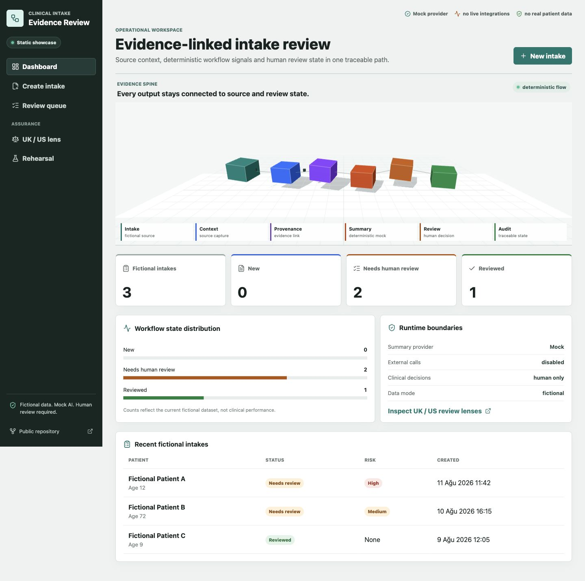
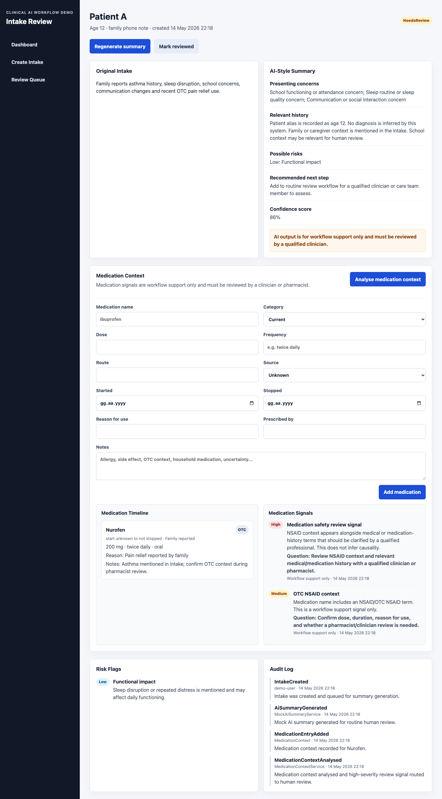
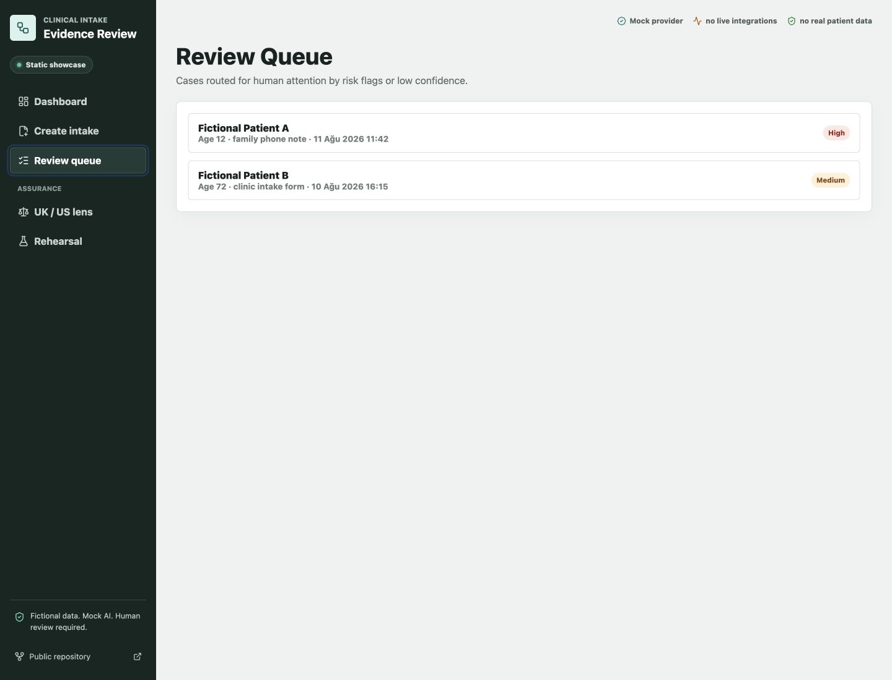
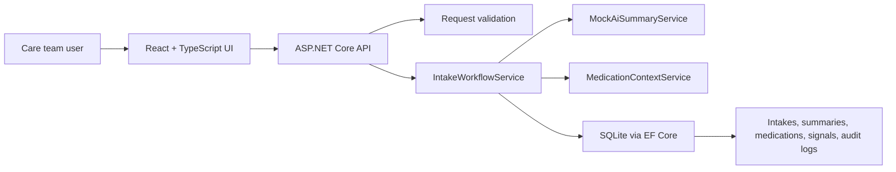

# Clinical Intake AI Workflow

[](https://github.com/Pharmacist65/clinical-intake-ai-workflow/actions/workflows/ci.yml)

A small full-stack healthtech application that models a safe clinical intake workflow: capturing fictional intake notes, generating deterministic AI-style workflow summaries, flagging possible priority terms, routing cases for human review, and preserving an audit trail.

The project is intentionally scoped as a small MVP for exploring safe clinical workflow automation. It does not diagnose, prescribe, triage autonomously, or replace clinicians. It uses mock AI logic so the workflow can run locally without API keys, real patient data, or hidden model behaviour.

## Project Scope

Clinical teams often receive intake information as free text from calls, forms, family messages, or referrals. A useful first software step is not to automate clinical judgment. It is to preserve the original note, make workflow state visible, surface possible safety or priority terms, and route uncertain cases to qualified human review.

This application focuses on that workflow:

- intake capture
- deterministic AI-style summarisation
- medication-history context capture
- risk flag visibility
- confidence scoring
- human review queue
- review status updates
- audit logs

## What This Project Demonstrates

- Clinical workflow understanding: intake capture, review queues, status transitions, risk visibility, and audit history
- Healthtech product thinking: human review is central, original notes remain visible, and limitations are explicit
- C# ASP.NET Core backend fundamentals: minimal API endpoints, validation, service-layer workflow logic, and consistent error responses
- React + TypeScript frontend: dashboard, intake creation, detail view, summary generation, and review queue UI
- Database-backed workflow: SQLite with Entity Framework Core models for intakes, summaries, risk flags, and audit logs
- Pharmacy context layer: medication-history capture, pharmacist-review signals, and medication timeline
- Safe applied AI design: deterministic mock AI, no API keys required, confidence scoring, disclaimers, and constrained output
- Human-in-the-loop review: high-risk or low-confidence cases are routed to `NeedsReview`
- Auditability: intake creation, summary generation, medication context analysis, and review status updates are recorded

## Product Summary

The app lets a care team user:

1. Create a fictional intake note.
2. Generate a deterministic AI-style structured summary.
3. See possible risk flags and confidence score.
4. Record medication-history context for pharmacist/clinician review.
5. Generate medication review signals and reviewer questions.
6. Route high-risk or low-confidence cases to review.
7. Mark cases as reviewed.
8. Inspect the audit log for key workflow actions.

## Screenshots

The screenshots below use fictional demo data only.

### Dashboard



### Intake Detail



### Review Queue



## Tech Stack

- Backend: ASP.NET Core Web API, C#
- Runtime target: .NET 8 LTS
- Database: SQLite with Entity Framework Core
- Tests: xUnit
- Frontend: React, TypeScript, Vite
- AI mode: deterministic mock service, no real API key required
- CI: GitHub Actions runs backend tests and frontend build on push and pull request

## Architecture Overview



The backend keeps HTTP handling thin. Request validation lives in small validators, workflow transitions live in `IntakeWorkflowService`, response mapping lives in `IntakeMapper`, deterministic summary generation lives behind `IAiSummaryService`, and medication review signals are generated by `MedicationContextService`.

## Pharmacy Context Layer

The Pharmacy Context Layer adds medication-history capture and pharmacist-review context to the intake workflow. It is intended to surface information that can be missed during intake, especially OTC medicines, incomplete dose/frequency details, household medication context, and possible adverse reaction history.

Medication outputs are framed only as workflow support signals and reviewer questions. The system does not diagnose, prescribe, recommend treatment, infer causality, or perform real drug-interaction checking.

This feature does not perform medication reconciliation, drug interaction checking, clinical decision support, prescribing advice, or diagnosis. It only captures medication context and creates review prompts for qualified human review.

Medication context can contribute to `NeedsReview` routing when a high-severity medication signal is generated. This is a workflow routing signal for human review, not autonomous triage.

See [docs/pharmacy-context-layer.md](docs/pharmacy-context-layer.md) for the full safety explanation.

## API Documentation

Base URL for local development:

```text
http://localhost:5108
```

All responses are JSON.

### Error Response Shape

Validation errors return `400 Bad Request`:

```json
{
  "code": "validation_error",
  "message": "Request validation failed.",
  "errors": [
    {
      "field": "PatientAlias",
      "message": "PatientAlias is required."
    }
  ]
}
```

Missing intakes return `404 Not Found`:

```json
{
  "code": "not_found",
  "message": "Intake not found.",
  "errors": []
}
```

Unexpected failures return `500 Internal Server Error` with the same simple error contract:

```json
{
  "code": "server_error",
  "message": "An unexpected error occurred.",
  "errors": []
}
```

### Endpoints

| Method | Endpoint | Success | Purpose |
| --- | --- | --- | --- |
| `GET` | `/api/health` | `200 OK` | Basic API health check |
| `POST` | `/api/intakes` | `201 Created` | Create a new fictional intake |
| `GET` | `/api/intakes` | `200 OK` | List intakes with status and highest risk |
| `GET` | `/api/intakes/{id}` | `200 OK` | Get one intake with summary, flags, medication context, signals, and audit logs |
| `POST` | `/api/intakes/{id}/generate-summary` | `200 OK` | Generate or regenerate deterministic AI-style summary |
| `GET` | `/api/review-queue` | `200 OK` | List intakes currently marked `NeedsReview` |
| `PATCH` | `/api/intakes/{id}/review-status` | `200 OK` | Update review status and create audit log entry |
| `GET` | `/api/intakes/{id}/audit-log` | `200 OK` | Read audit log entries for one intake |
| `POST` | `/api/intakes/{id}/medications` | `201 Created` | Add medication-history context |
| `GET` | `/api/intakes/{id}/medications` | `200 OK` | List medication entries for one intake |
| `POST` | `/api/intakes/{id}/analyse-medication-context` | `200 OK` | Generate medication review signals |
| `GET` | `/api/intakes/{id}/medication-signals` | `200 OK` | List medication review signals |

### Create Intake

`POST /api/intakes`

Request:

```json
{
  "patientAlias": "Patient A",
  "age": 12,
  "intakeText": "Family reports school concerns, poor sleep and attention changes.",
  "source": "family phone note",
  "createdBy": "demo-user"
}
```

Validation:

- `patientAlias` is required, max 120 characters.
- `age` must be between 0 and 120.
- `intakeText` is required, max 8000 characters.
- `source` is required, max 80 characters.
- `createdBy` is required, max 120 characters.

### Generate Summary

`POST /api/intakes/{id}/generate-summary`

The summary is generated by `MockAiSummaryService`. If a summary already exists, it is updated and previous risk flags are replaced. This keeps regeneration deterministic and avoids stale flags.

Routing rule:

- If confidence is below `0.75`, set `reviewStatus` to `NeedsReview`.
- If any risk flag is `High`, set `reviewStatus` to `NeedsReview`.
- Otherwise keep the case in `New` until a human reviewer marks it reviewed.

### Update Review Status

`PATCH /api/intakes/{id}/review-status`

Request:

```json
{
  "reviewStatus": "Reviewed",
  "actor": "clinical-reviewer"
}
```

Validation:

- `reviewStatus` must be `New`, `NeedsReview`, or `Reviewed`.
- `actor` is required, max 120 characters.

Every status change creates an audit log entry.

### Add Medication Context

`POST /api/intakes/{id}/medications`

Request:

```json
{
  "medicationName": "Ibuprofen",
  "category": "OTC",
  "dose": "200 mg",
  "route": "oral",
  "frequency": "up to three times daily",
  "startedAt": null,
  "stoppedAt": null,
  "reasonForUse": "Pain relief",
  "source": "FamilyReported",
  "prescribedBy": null,
  "notes": "Family unsure about duration"
}
```

Medication categories:

- `Current`
- `Recent`
- `Past`
- `OTC`
- `FamilyHousehold`

Medication sources:

- `PatientReported`
- `FamilyReported`
- `ClinicianReported`
- `Unknown`

### Analyse Medication Context

`POST /api/intakes/{id}/analyse-medication-context`

This endpoint runs deterministic medication-history rules and creates review signals. NSAID context can come from the medication name, intake text, or medication notes. It does not perform clinical decision support or real drug-interaction checking.

Examples of generated signals:

- OTC NSAID context
- Medication safety review signal
- Incomplete medication history
- Polypharmacy context
- Household medication context
- Possible adverse reaction history

## Database Models

### Intake

- `id`
- `patientAlias`
- `age`
- `intakeText`
- `source`
- `reviewStatus`: `New`, `NeedsReview`, `Reviewed`
- `createdAt`
- `createdBy`

### AiSummary

- `id`
- `intakeId`
- `presentingConcerns`
- `relevantHistory`
- `possibleRisks`
- `recommendedNextStep`
- `confidenceScore`
- `generatedAt`
- `disclaimer`

### RiskFlag

- `id`
- `intakeId`
- `label`
- `severity`: `Low`, `Medium`, `High`
- `reason`

### AuditLog

- `id`
- `intakeId`
- `action`
- `actor`
- `timestamp`
- `details`

### MedicationEntry

- `id`
- `intakeId`
- `medicationName`
- `normalizedName`
- `category`: `Current`, `Recent`, `Past`, `OTC`, `FamilyHousehold`
- `dose`
- `route`
- `frequency`
- `startedAt`
- `stoppedAt`
- `reasonForUse`
- `source`: `PatientReported`, `FamilyReported`, `ClinicianReported`, `Unknown`
- `prescribedBy`
- `notes`
- `createdAt`

### MedicationSignal

- `id`
- `intakeId`
- `medicationEntryId`
- `label`
- `severity`: `Low`, `Medium`, `High`
- `rationale`
- `reviewerQuestion`
- `createdAt`

## Healthcare AI Safety Design

The app is intentionally constrained:

- It does not diagnose.
- It does not prescribe.
- It does not recommend treatment.
- It does not autonomously triage.
- It does not use real patient data.
- It stores the original intake beside the generated summary.
- It uses deterministic mock AI rules in this version.
- It includes a confidence score and safety disclaimer.
- High-risk keywords route the case to human review.
- Low-confidence summaries route the case to human review.
- Medication outputs are review signals and questions only.
- High-severity medication signals route the case to human review.
- Audit logs record intake creation, summary generation, medication context analysis, and review status updates.

Generated summaries always include:

> AI output is for workflow support only and must be reviewed by a qualified clinician.

## Limitations

- No real patient data should be entered.
- The AI behaviour is a deterministic mock, not a real LLM integration.
- The medication context layer is not a real drug-interaction engine.
- The pharmacy context feature does not perform medication reconciliation, drug interaction checking, clinical decision support, prescribing advice, or diagnosis.
- Keyword rules are simplistic and will miss clinical nuance.
- Absence of a risk flag does not mean absence of clinical risk.
- No authentication, role-based access control, or production security hardening is implemented.
- SQLite and `EnsureCreated` are used for local development simplicity.
- The application is not deployed or monitored as a production service.

## Future Improvements

Planned improvements, not currently implemented:

- Real LLM integration via API with an environment-variable based adapter
- Retrieval-augmented generation over approved clinical policy documents
- FHIR/HL7 integration concept for interoperability
- Role-based access control
- Docker deployment
- Observability and monitoring
- More robust evaluation dataset for routing and summary behaviour

## How To Run Backend

Install the .NET 8 SDK, then:

```bash
cd backend/ClinicalIntake.Api
dotnet restore
dotnet run --urls http://localhost:5108
```

The API creates a local SQLite database file automatically.

## How To Run Frontend

In a second terminal:

```bash
cd frontend
npm install
npm run dev
```

Open `http://localhost:5173`.

If your backend runs on a different URL, create `frontend/.env.local`:

```bash
VITE_API_BASE_URL=http://localhost:5108
```

## How To Run Tests

```bash
dotnet test backend/ClinicalIntake.Api.Tests
```
