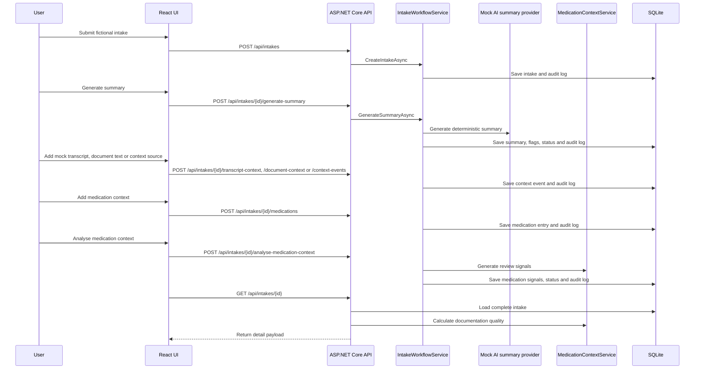

# Architecture

## Goal

The project models a simple clinical intake workflow:

1. A care team member creates an intake from a fictional note.
2. The backend stores the original note.
3. A deterministic mock AI service generates structured workflow support output.
4. Risk flags and confidence determine whether the case needs review.
5. Additional fictional text context sources can be recorded with source provenance.
6. Medication-history context can be recorded and assessed for documentation completeness.
7. Medication context can be analysed for pharmacist/clinician review signals.
8. Human review actions, including optional workflow review notes, are captured in the audit log.

## Components

### Frontend

The React/Vite frontend is intentionally small. It provides:

- Dashboard counts for `New`, `NeedsReview` and `Reviewed`
- Intake creation form
- Intake detail view with original text, summary, risk flags and audit log
- Mock transcript ingestion form, mock document/OCR text form, context source form and captured context list
- Medication context form, medication timeline, documentation quality summary and medication review signals
- Optional reviewer note input when marking a case reviewed
- Review queue for cases that require human attention

The frontend calls the backend through `frontend/src/api.ts`. The API base URL defaults to `http://localhost:5108` and can be overridden with `VITE_API_BASE_URL`.

### Backend API

The ASP.NET Core API exposes minimal endpoints for intake creation, summary generation, review queue and audit history. Endpoint handlers run request validation, return consistent error responses and delegate workflow rules to `IntakeWorkflowService`. Swagger/OpenAPI is available at `/swagger` for local endpoint inspection.

Keeping validation, mapping and workflow logic separated makes the code easier to inspect and maintain:

- Request and response shapes live in `Contracts`.
- Validation lives in `IntakeRequestValidator`.
- Response mapping lives in `IntakeMapper`.
- Workflow state changes live in `IntakeWorkflowService`.
- Mock summary generation lives behind `IAiSummaryService` and is selected through the mock-first AI provider boundary.
- Fictional startup demo data lives in `DemoDataSeeder`.
- Text context provenance is captured through `ContextEvent`.
- Medication-history documentation quality and review signals are generated by `MedicationContextService`.

### Data Access

Entity Framework Core persists data to SQLite. The first version uses `EnsureCreated` to keep local setup simple. If the database is empty and `DemoData:SeedOnStartup` is enabled, fictional seed cases are created so the app opens with useful workflow examples. A production version would use migrations and environment-specific database configuration.

### Local Docker Setup

The repository includes Dockerfiles for the backend and frontend plus a root `docker-compose.yml` for local development. The compose setup runs:

- the ASP.NET Core API on host port `5108`
- the Vite frontend on host port `5173`
- SQLite in a named Docker volume mounted at `/data`

This is a developer convenience, not a production deployment design. Production hosting would need proper migrations, secrets management, authentication, monitoring, HTTPS termination and environment-specific infrastructure.

See [production-deployment-design.md](production-deployment-design.md) for the production deployment considerations and readiness checklist.

### Mock AI Service

The registered mock summary provider is deterministic. It scans for configured terms and produces:

- Presenting concerns
- Relevant history
- Possible risks
- Recommended next step
- Confidence score
- Risk flags

This keeps the project runnable without API keys and makes tests stable.

### AI Provider Boundary

The API registers summary generation through `AddAiSummaryProvider`. Configuration is read from the `AiSummary` section:

```json
{
  "AiSummary": {
    "Provider": "Mock",
    "ExternalProvidersEnabled": false
  }
}
```

Only the deterministic `Mock` provider is registered in this MVP. If a different provider name is configured, summary service resolution fails with an explicit adapter-boundary error rather than silently making an external AI call. Future LLM adapters should be added as separate services behind `IAiSummaryService`, reviewed independently, and kept disabled unless explicitly configured.

### Evaluation Dataset

The backend test suite includes a small fictional evaluation dataset for deterministic workflow checks. These cases run through the real workflow service and assert expected review routing, confidence thresholds, risk flag labels, medication signal labels and medication documentation quality status.

This is regression coverage for the MVP's workflow rules, not clinical validation. It does not claim diagnostic accuracy, prescribing safety, autonomous triage safety or real-world model performance.

### Pharmacy Context Layer

`MedicationContextService` is deterministic. It calculates a documentation quality score from captured medication-history fields and scans medication entries/intake context for review signals such as incomplete medication history, household medication context, polypharmacy context, possible adverse reaction history and OTC NSAID context.

NSAID handling is one concrete OTC medication-context example, not the centre of the design. The layer is broader: it models how medication-history documentation gaps and review questions can be captured and routed to pharmacist/clinician review without making clinical decisions.

This is not a prescribing tool, diagnosis tool, autonomous triage system or real drug-interaction engine. The documentation score is a completeness indicator only, not a clinical risk score.

### Interoperability Concept

The project includes a FHIR/HL7 integration concept document and a FHIR-style fictional export endpoint, but no live integration. The intent is to show how the internal workflow could later map to healthcare interoperability concepts while keeping the MVP small.

Possible conceptual mappings include:

- `Intake` to form/referral concepts such as `QuestionnaireResponse`, `ServiceRequest`, or an internal case/task model
- `MedicationEntry` to `MedicationStatement`
- `ReviewStatus` to workflow state such as `Task.status`
- `AuditLog` to `AuditEvent` or `Provenance`

The export endpoint returns a local fictional bundle with FHIR-like resource names. It is not a validated FHIR implementation and does not connect to a FHIR server, EHR, NHS service, pharmacy system or HL7 feed.

See [fhir-hl7-integration-concept.md](fhir-hl7-integration-concept.md) for the full mapping and safety boundaries.

### Multimodal Clinical Context Concept

The project implements a small first step toward the multimodal clinical context concept: text-derived context from multiple sources can be recorded as `ContextEvent` records. Dedicated mock transcript and mock document endpoints store pasted fictional source text as `TranscriptText` and `DocumentText`; the generic context endpoint can also store medication-history notes and manual team notes.

This is still text-only workflow support. The current application does not process audio, clinical images, scanned documents, real patient records or live healthcare feeds. Real speech-to-text and OCR adapters remain planned only. The current implementation preserves source provenance and includes evidence snippets on deterministic risk flags and medication review signals so reviewers can inspect why a workflow prompt was created.

See [multimodal-clinical-context-layer.md](multimodal-clinical-context-layer.md) for the proposed model, workflow and safety boundaries.

## Workflow Rules

- New intakes start with `ReviewStatus.New`.
- Summary generation replaces the previous summary and risk flags for the intake.
- If the confidence score is below `0.75`, the intake is routed to `NeedsReview`.
- If any risk flag is `High`, the intake is routed to `NeedsReview`.
- If any medication signal is `High`, the intake is routed to `NeedsReview`.
- Risk flags and medication signals can include an evidence source label and short snippet for reviewer inspection.
- Context events are provenance records only; they do not change review status by themselves. Summary generation can use recorded text context to create deterministic review signals with evidence snippets.
- Review status changes are appended to the audit log with an optional workflow review note.

## Data Flow


