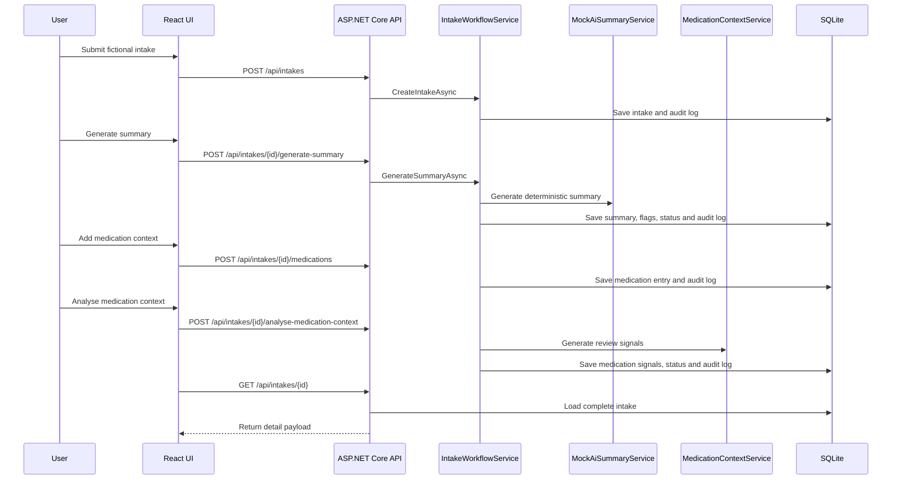

# Architecture

## Goal

The project models a simple clinical intake workflow:

1. A care team member creates an intake from a fictional note.
2. The backend stores the original note.
3. A deterministic mock AI service generates structured workflow support output.
4. Risk flags and confidence determine whether the case needs review.
5. Medication-history context can be recorded and analysed for pharmacist/clinician review signals.
6. Human review actions are captured in the audit log.

## Components

### Frontend

The React/Vite frontend is intentionally small. It provides:

- Dashboard counts for `New`, `NeedsReview` and `Reviewed`
- Intake creation form
- Intake detail view with original text, summary, risk flags and audit log
- Medication context form, medication timeline and medication review signals
- Review queue for cases that require human attention

The frontend calls the backend through `frontend/src/api.ts`. The API base URL defaults to `http://localhost:5108` and can be overridden with `VITE_API_BASE_URL`.

### Backend API

The ASP.NET Core API exposes minimal endpoints for intake creation, summary generation, review queue and audit history. Endpoint handlers run request validation, return consistent error responses and delegate workflow rules to `IntakeWorkflowService`.

Keeping validation, mapping and workflow logic separated makes the code easier to scan in an interview:

- Request and response shapes live in `Contracts`.
- Validation lives in `IntakeRequestValidator`.
- Response mapping lives in `IntakeMapper`.
- Workflow state changes live in `IntakeWorkflowService`.
- Mock summary generation lives behind `IAiSummaryService`.
- Medication-history review signals are generated by `MedicationContextService`.

### Data Access

Entity Framework Core persists data to SQLite. The first version uses `EnsureCreated` to keep local setup simple. A production version would use migrations and environment-specific database configuration.

### Mock AI Service

`MockAiSummaryService` is deterministic. It scans for configured terms and produces:

- Presenting concerns
- Relevant history
- Possible risks
- Recommended next step
- Confidence score
- Risk flags

This keeps the project runnable without API keys and makes tests stable.

### Pharmacy Context Layer

`MedicationContextService` is deterministic. It scans medication entries and intake context for review signals such as OTC NSAID context, incomplete medication history, household medication context, polypharmacy context and possible adverse reaction history.

This is not a prescribing tool, diagnosis tool, autonomous triage system or real drug-interaction engine. It only creates workflow support signals and reviewer questions.

## Workflow Rules

- New intakes start with `ReviewStatus.New`.
- Summary generation replaces the previous summary and risk flags for the intake.
- If the confidence score is below `0.75`, the intake is routed to `NeedsReview`.
- If any risk flag is `High`, the intake is routed to `NeedsReview`.
- If any medication signal is `High`, the intake is routed to `NeedsReview`.
- Review status changes are appended to the audit log.

## Data Flow

