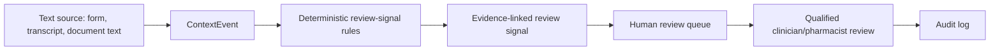

# Multimodal Clinical Context Layer Concept

This document describes a future architecture concept for handling clinical intake context from multiple sources while keeping the application inside a safe workflow-support boundary.

It is documentation only. The current application does not process audio, images, scanned clinical documents, real patient records, or live healthcare system feeds.

## Why This Matters

Clinical intake information often arrives in fragmented forms:

- free-text intake forms
- phone call notes or transcripts
- referral letters
- medication lists
- family or caregiver messages
- follow-up notes from different team members

A useful healthtech workflow should preserve where each piece of context came from, make important review prompts visible, and help a qualified human reviewer inspect the underlying evidence.

The goal is not to replace clinical judgment. The goal is to reduce workflow friction and make relevant context easier to find.

## Safe Scope

The future context layer should handle text-derived context only:

- direct text entered by a user
- voice transcript text generated by a separate transcription system
- document/OCR text from fictional or approved non-patient examples
- structured metadata about the source, timing and author

The system should not:

- diagnose
- prescribe
- recommend treatment
- autonomously triage
- claim that all risk can be detected
- interpret clinical images
- process real patient data in this demo
- connect to live NHS, EHR, pharmacy, FHIR or HL7 systems

Any future audio, OCR or LLM adapter should sit behind an interface and be disabled unless explicitly configured. Mock mode should remain the default.

## Proposed Data Model

A future implementation could introduce a generic `ContextEvent` model:

| Field | Purpose |
| --- | --- |
| `id` | Unique context event identifier |
| `intakeId` | Parent intake |
| `sourceType` | `IntakeText`, `TranscriptText`, `DocumentText`, `MedicationHistory`, `ManualNote` |
| `sourceLabel` | Human-readable source description |
| `content` | Captured text content |
| `capturedAt` | When the context was captured |
| `createdBy` | User or system that added the context |
| `confidenceScore` | Optional extraction/transcription confidence |
| `metadataJson` | Optional structured metadata for source-specific details |

This model would preserve context provenance without forcing every source into the same clinical meaning.

## Evidence-Linked Review Signals

Future review signals should point back to short evidence snippets instead of appearing as unsupported alerts.

Example future shape:

```json
{
  "label": "Medication context requires review",
  "severity": "High",
  "rationale": "A medication review prompt was created from the documented context.",
  "reviewerQuestion": "Clarify medication use and relevant history with a qualified clinician or pharmacist.",
  "sourceType": "TranscriptText",
  "evidenceSnippet": "Family mentioned recent ibuprofen use and asthma history...",
  "workflowSupportOnly": true
}
```

The evidence snippet should help the reviewer understand why the prompt exists. It should not be framed as a diagnosis, treatment recommendation or drug-interaction result.

## Workflow



## Latency And Safety

Fast processing can improve workflow usability, but low latency should not be confused with clinical safety.

A future system might aim to process new context quickly enough to support responsive UI updates. That should be treated as an engineering performance goal only. It should not create claims such as zero missed risk, autonomous triage, or real-time clinical decision-making.

Safety should come from:

- preserving the original source text
- showing evidence snippets
- keeping outputs as reviewer prompts
- routing uncertain or high-severity signals to human review
- logging workflow actions
- testing deterministic behaviour with fictional evaluation cases

## Future Implementation Steps

1. Add the `ContextEvent` model and API endpoints for fictional text context.
2. Add evidence snippets to generated review signals.
3. Add a mock transcript text ingestion endpoint.
4. Add a mock document/OCR text ingestion endpoint.
5. Extend the fictional evaluation dataset with context-event scenarios.
6. Add optional adapters for transcription, OCR or LLM extraction only after the mock workflow is stable.

Each step should keep fictional data, human review and auditability as default design constraints.

## Interview Explanation

I would explain this as a future-safe architecture concept, not an implemented multimodal AI system.

The important product decision is that different sources of intake context should be captured with provenance and linked to reviewer prompts. The system should not hide source material behind AI output. A clinician or pharmacist should be able to see what text triggered a workflow signal, inspect the original context, and make their own judgment.

That framing keeps the project realistic for healthtech: useful workflow automation, clear safety boundaries, and no overclaiming of medical capability.
