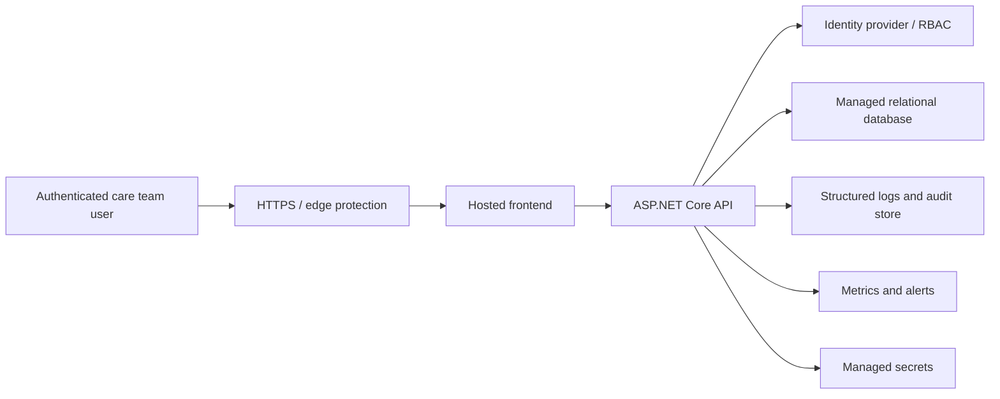

# Production Deployment Design

This document describes what would need to change before this small MVP could be considered for a production healthcare environment.

The current repository is not a production deployment. It is a local, fictional-data workflow application for exploring safe clinical intake automation.

## Deployment Position

The project currently provides:

- local ASP.NET Core API
- local React/Vite frontend
- SQLite for simple local persistence
- deterministic mock AI rules
- local Docker Compose for developer convenience
- GitHub Actions CI for backend tests and frontend build

A production version would require a separate deployment design, security review, clinical safety review, data protection review, and operational runbook.

## Target Production Shape

The backend should stay the workflow system of record. External systems such as FHIR servers, EHRs, pharmacy systems, LLM providers, transcription tools, or OCR services should be integrated through explicit adapters rather than mixed into the core workflow service.

## Environment Configuration

Production configuration should be environment-specific and injected at runtime.

| Area | Local MVP | Production expectation |
| --- | --- | --- |
| Database | SQLite with `EnsureCreated` | Managed database with migrations |
| Secrets | None required for mock mode | Managed secret store |
| AI mode | Deterministic mock rules | Optional adapter, disabled unless configured |
| API docs | Swagger enabled for local/dev | Disabled or protected |
| Demo data | Seeded fictional examples | Disabled |
| CORS | Local frontend origins | Specific production frontend origins |
| Logging | Console logs | Structured central logging |
| Auth | Not implemented | Identity provider and role-based access |

Example production settings should include:

- `ASPNETCORE_ENVIRONMENT=Production`
- `ApiDocs__Enabled=false`
- `DemoData__SeedOnStartup=false`
- `ConnectionStrings__DefaultConnection=<managed database connection>`
- frontend `VITE_API_BASE_URL=<production API URL>`

No API keys or secrets should be committed to the repository.

## Database And Migrations

The MVP uses EF Core `EnsureCreated` for local simplicity. Production should use:

- EF Core migrations
- migration review in CI
- controlled migration execution during release
- managed backups and restore testing
- environment-specific connection strings
- retention and deletion policies

SQLite is appropriate for local development only. Production should use a managed relational database such as PostgreSQL, SQL Server, or another organisation-approved database.

## Authentication And Access Control

A production version should require authenticated users.

Minimum roles:

| Role | Example access |
| --- | --- |
| Intake creator | Create fictional/intake records in permitted workspace |
| Reviewer | Generate workflow summaries, review signals, mark reviewed |
| Pharmacist reviewer | Review medication-context signals and documentation gaps |
| Admin | Manage users, configuration, audit access |
| Auditor | Read audit logs without editing workflow state |

The application should not rely on free-text `createdBy` or `actor` fields in production. Those should be derived from authenticated identity claims.

## Audit And Traceability

The MVP audit log is useful for demonstration, but production audit design should be richer.

Production audit events should capture:

- authenticated user ID
- role or permission scope
- action name
- entity type and entity ID
- timestamp
- request correlation ID
- source IP or trusted proxy context where appropriate
- before/after state for important status changes
- failure events for denied or invalid actions

Audit logs should be tamper-resistant and queryable for governance review.

## Observability And Monitoring

Production monitoring should include:

- API availability and latency
- failed request rate
- validation error rate
- summary generation failures
- review queue volume and age
- high-severity signal counts
- medication documentation quality trends
- audit log write failures
- database health and backup status

Alerts should route to an accountable support process. Monitoring should not expose patient-identifiable content in logs or metrics.

## Healthcare AI Safety Controls

The safety position should remain the same even if optional AI adapters are added:

- no diagnosis
- no prescribing
- no treatment recommendation
- no autonomous triage
- no medication reconciliation
- no drug-interaction checking
- no clinical decision support claims
- human review remains required

Any future LLM, OCR, transcription, FHIR, or EHR adapter should be disabled by default and separately reviewed before use.

Production safety work should include:

- clinical safety case
- workflow risk assessment
- human factors review
- evaluation dataset expansion
- failure-mode review
- incident response process
- rollback plan

## Data Protection

This public demo uses fictional data only. A real deployment would need:

- data protection impact assessment
- lawful basis and consent/notice review
- encryption in transit and at rest
- access controls and least privilege
- retention and deletion policy
- backups and restore process
- data export process
- secure handling of support access
- regional hosting and processor review

Real patient data should not be entered into the public demo repository or local sample app.

## Release Process

A production release process should include:

1. Pull request review.
2. Backend tests.
3. Frontend build.
4. Security/dependency scanning.
5. Migration review.
6. Environment-specific deployment.
7. Smoke tests.
8. Monitoring checks.
9. Rollback instructions.

The current GitHub Actions CI is a good MVP signal, but it is not enough for production release governance.

## Production Readiness Checklist

- [ ] Replace SQLite/`EnsureCreated` with managed database and migrations.
- [ ] Add authentication and role-based access control.
- [ ] Move actor fields to authenticated identity claims.
- [ ] Disable or protect Swagger in production.
- [ ] Disable demo seed data in production.
- [ ] Add structured logging and correlation IDs.
- [ ] Add metrics and alerting.
- [ ] Add centralized, tamper-resistant audit logging.
- [ ] Add backup and restore testing.
- [ ] Add secrets management.
- [ ] Add CORS and security header hardening.
- [ ] Add rate limiting and request size limits.
- [ ] Complete data protection and clinical safety reviews.
- [ ] Document incident response and rollback.

## What Stays Out Of Scope For This MVP

The current project should not add production infrastructure just to look bigger. The valuable production signal is that the boundaries are understood.

Out of scope for this MVP:

- live NHS/EHR/FHIR/HL7 integration
- real patient data handling
- real OCR or speech-to-text processing
- real LLM calls by default
- production identity provider setup
- cloud hosting scripts
- clinical safety certification

Those would be separate workstreams after governance, security, privacy, and clinical safety requirements are known.
